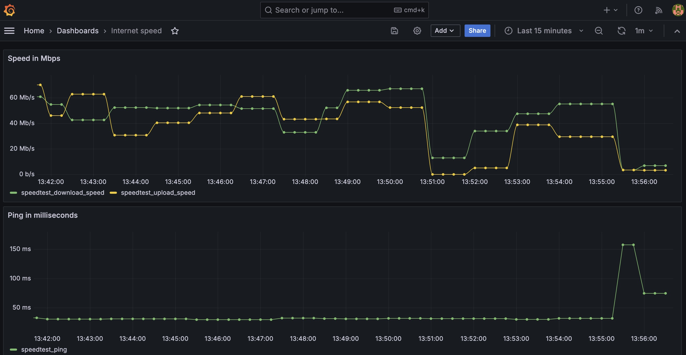

# internet_metrics
Docker compose to setup internet speed exporter with prometheus and grafana to monitor and visualize

# requirements
docker

# STEP 1. build exporter
cd to cloned directory and run
```
docker build -t speedtest-exporter .
```
# STEP 2. run container
PUSH_IP : IP address or hostname of the prometheus push gateway
CLIENT_NAME : A label to identify the client
```
docker run -d -e PUSH_IP="<PUSH_IP>" -e CLIENT_NAME="<CLIENT_NAME>" --restart unless-stopped speedtest-exporter
```

For example,
```
docker run -d -e PUSH_IP="1.2.3.4" -e CLIENT_NAME="Bob" --restart unless-stopped speedtest-exporter
```
# STEP 3. access grafana dashboard in browser
Access http://<PUSH_IP>:3000.  
Initial user password admin/5tr0nGpa55  
Check internet-speed dashboard in grafana  

# STEP 4. stop containers
```
docker stop <container-id>
```

# How it looks



# Disclaimer
The metrics are collected using speedtest-cli. All metrics are not entirely reliable as per the details in:
https://github.com/sivel/speedtest-cli
